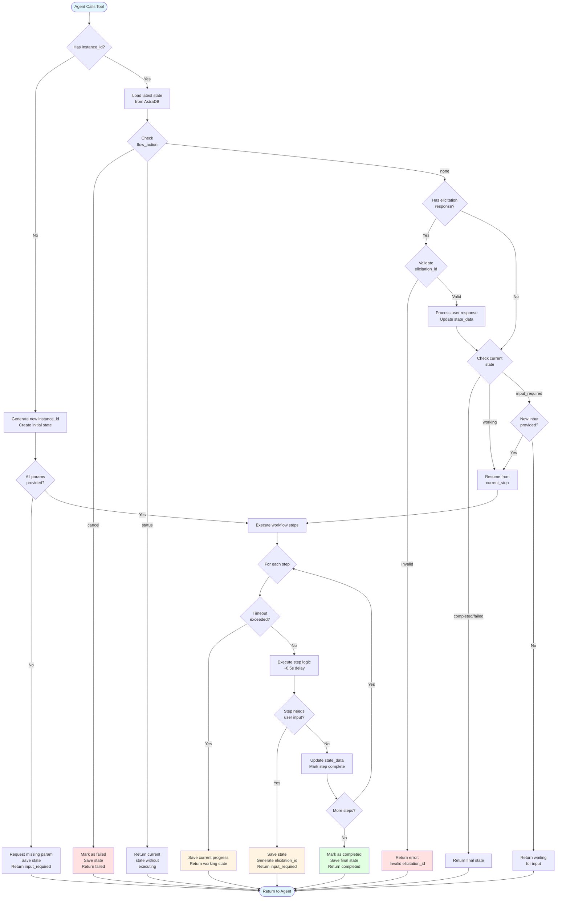
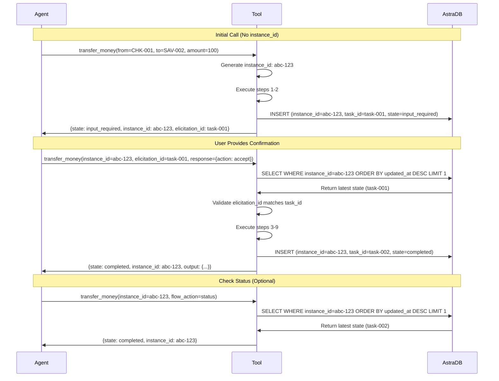
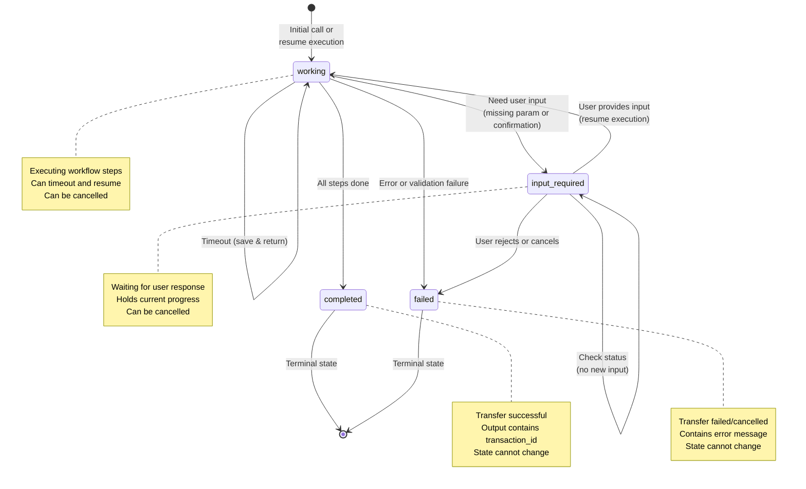

# Transfer Money Tool Specification

## Overview

The `transfer_money` tool is a **re-entrant Python tool** that demonstrates how to **simulate** long-running stateful operations using external state persistence. It implements a **mock** stateful money transfer workflow with persistent state storage in AstraDB.

**Critical Architecture Note**:
Python tools are **stateless** and **not long-running**. Each tool invocation is a new, short-lived process that cannot run background operations. This tool **simulates** long-running behavior by:
- Persisting state to an external database (AstraDB) between invocations
- Using re-entrant calls with the same `instance_id` to resume from saved state
- Checking elapsed time to simulate background processing progress

**For production use cases requiring true long-running operations**, use **wxO Agentic Workflow** instead, which provides native support for background execution, state management, and asynchronous processing.

**Important**: This is a **demonstration tool only**. No real money transfers occur. It simulates banking operations to showcase re-entrant patterns.

### Purpose

This tool serves as a **reference implementation** for building tools that **simulate** stateful operations by:
- Using external state persistence (AstraDB) to maintain state across invocations
- Enabling **AI agent digression** - users can ask unrelated questions and return to the operation later
- Maintaining **conversation continuity** - the agent can resume operations seamlessly after interruptions
- Handling **user input collection** through natural conversation flow via elicitation
- Providing **status tracking** so users can check progress at any time
- Supporting **cancellation** when users change their mind

**Important Limitation**: Python tools cannot actually run operations in the background. Each invocation is synchronous and short-lived. This example simulates long-running behavior through re-entrant calls and time-based state checks.

The banking transfer scenario is used as a practical example, but the patterns demonstrated apply to any scenario where you need to maintain state across multiple tool invocations.

### Key Techniques Demonstrated

1. **Simulated Background Processing** - Tool simulates long-running operations by checking elapsed time between invocations (not actual background execution)
2. **Re-entrant Calls** - Same tool can be called multiple times with `instance_id` to resume from saved state
3. **Manual State Persistence** - Tool explicitly saves state to AstraDB using `state_store.save()` and loads it using `state_store.load()`
4. **User Input Elicitation** - Tool can pause and request user input mid-execution
5. **Cancellation Support** - Users can cancel operations at any time via `transfer_action="cancel"`

**Note**: These are simulation techniques. For true background processing and long-running workflows, use wxO Agentic Workflow.

## Tool Metadata

- **Name**: `transfer_money`
- **Type**: Python Tool (re-entrant)
- **Permission**: `READ_WRITE`
- **State Storage**: AstraDB (Table API)
- **Default Timeout**: 10 seconds (non-interrupt timeout for synchronous execution)

## Required Connections

1. **astra_flow_state** (API_KEY_AUTH)
   - AstraDB authentication token
   - Format: `AstraCS:...`

2. **astra_url** (KEY_VALUE)
   - AstraDB API endpoint URL
   - Key: `api_endpoint`
   - Format: `https://[database-id]-[region].apps.astra.datastax.com`

## Parameters

### Input Parameters

| Parameter | Type | Required | Description |
|-----------|------|----------|-------------|
| `from_account` | string | No | Source account ID (e.g., "CHK-001"). If not provided, tool will request via elicitation |
| `to_account` | string | No | Destination account ID (e.g., "SAV-002"). If not provided, tool will request via elicitation |
| `amount` | float | No | Transfer amount (must be positive). If not provided, tool will request via elicitation |
| `instance_id` | string | No | Existing flow instance ID for re-entrant calls. If not provided, a new UUID will be generated |
| `transfer_action` | string | No | Transfer control action: "cancel", "status", or "input_changed" |
| `elicitation_id` | string | No | ID of elicitation being responded to (matches task_id from previous response) |
| `elicitation_response` | object | No | User's response to elicitation (ElicitationResponse object or dict) |

**Note**: All parameters are optional. The tool will request missing required information through elicitation, enabling natural conversational flow.

### Instance ID and Task ID Behavior

**Instance ID:**
- **New Flow**: If `instance_id` is not provided, a new UUID is automatically generated
- **Resume Flow**: If `instance_id` is provided, the tool loads the most recent state for that instance
- **Format**: UUIDs in format `550e8400-e29b-41d4-a716-446655440000`

**Elicitation ID (Task ID):**
- When responding to an elicitation, provide the `elicitation_id` from the previous response
- The tool validates that the `elicitation_id` matches the last `task_id` for the instance
- This ensures responses are applied to the correct interaction in the flow

### Transfer Action Values

The `transfer_action` parameter controls flow behavior:

| Action | Description | Use Case |
|--------|-------------|----------|
| `cancel` | Terminate the transfer and mark as failed | User wants to abort the operation |
| `status` | Get current status without executing steps | Check progress without modifying state |
| `input_changed` | Update parameters and restart from appropriate step | User wants to change transfer details mid-flow |

### Elicitation Response Structure

The `elicitation_response` parameter accepts an ElicitationResponse object or dict:

```json
{
  "value": "user_input_value",
  "action": "accept",
  "content": {
    "selected_value": "optional_selected_option"
  }
}
```

**Fields**:
- `value` (required): The user's response (string, number, boolean, etc.)
- `action` (optional, default="accept"): Action to take - "accept", "reject", or "cancel"
- `content` (optional): Additional data as a dictionary

## Re-entrant Behavior and State Management

### Core Concept

The `transfer_money` tool is **re-entrant**, meaning it can be called multiple times with the same `instance_id` to continue execution from where it left off. This enables:

1. **Resumption after timeout** - If execution exceeds 30 seconds, the tool saves state and returns. The agent can call again to continue.
2. **User input handling** - When user input is needed, the tool pauses, saves state, and waits for the response.
3. **Status checking** - The agent can check progress without modifying the flow.
4. **Cancellation** - The agent can cancel a running transfer at any time.

### State Tracking Architecture



### State Persistence Model

Each interaction with the tool creates a **new record** in AstraDB:



### Key State Tracking Principles

1. **Immutable History**: Each write creates a new row (new `task_id`), preserving complete audit trail
2. **Latest State Wins**: When resuming, the tool loads the most recent record for the `instance_id`
3. **Elicitation Validation**: The `elicitation_id` must match the last `task_id` to ensure responses apply to correct interaction
4. **Idempotent Reads**: Calling with `flow_action=status` doesn't modify state, just returns current status
5. **Checkpoint Recovery**: State is saved after each step, enabling resume from any point

### State Transitions



## Transaction States

The tool implements four states as defined in the MCP Task specification:

| State | Description | Next Actions |
|-------|-------------|--------------|
| `working` | Transaction is currently executing | Poll with same instance_id, or cancel |
| `input_required` | Transaction is waiting for user input | Provide elicitation_response |
| `completed` | Transaction finished successfully | None (terminal state) |
| `failed` | Transaction encountered error or was cancelled | None (terminal state) |

## Workflow Steps

The transfer process consists of 9 sequential steps:

1. **validate_input** - Validate parameters and request missing ones
2. **check_balance** - Verify sufficient funds in source account
3. **confirm_transfer** - Request user confirmation
4. **lock_accounts** - Lock accounts to prevent concurrent modifications
5. **debit_from_account** - Deduct amount from source account
6. **credit_to_account** - Add amount to destination account
7. **release_locks** - Release account locks
8. **record_transaction** - Generate and record transaction ID
9. **complete** - Finalize transfer and prepare output

Each step takes approximately 0.5 seconds to simulate processing time.

## Response Format

All responses include `output` and `status` sections.

### Completed State Response

```json
{
  "output": {
    "transaction_id": "TXN-ABC12345",
    "from_account": "CHK-001",
    "to_account": "SAV-002",
    "amount": 500.0,
    "status": "completed",
    "timestamp": "2026-03-27T14:00:00Z"
  },
  "status": {
    "instance_id": "550e8400-e29b-41d4-a716-446655440000",
    "name": "transfer_money",
    "state": "completed",
    "created_at": "2026-03-27T13:59:45Z",
    "updated_at": "2026-03-27T14:00:00Z"
  }
}
```

### Working State Response

```json
{
  "status": {
    "instance_id": "550e8400-e29b-41d4-a716-446655440000",
    "name": "transfer_money",
    "state": "working",
    "progress": {
      "current_step": "Processing debit...",
      "step_number": 5,
      "total_steps": 9
    },
    "created_at": "2026-03-27T13:59:45Z",
    "updated_at": "2026-03-27T13:59:50Z"
  }
}
```

### Input Required State Response

```json
{
  "status": {
    "instance_id": "550e8400-e29b-41d4-a716-446655440000",
    "name": "transfer_money",
    "state": "input_required",
    "elicitation": {
      "elicitation_id": "confirm-abc12345",
      "question": "Confirm transfer of $500.00 from CHK-001 to SAV-002?",
      "options": ["yes", "no"]
    },
    "progress": {
      "current_step": "Awaiting confirmation...",
      "step_number": 3,
      "total_steps": 9
    },
    "created_at": "2026-03-27T13:59:45Z",
    "updated_at": "2026-03-27T13:59:48Z"
  }
}
```

### Failed State Response

```json
{
  "status": {
    "instance_id": "550e8400-e29b-41d4-a716-446655440000",
    "name": "transfer_money",
    "state": "failed",
    "message": "Flow was cancelled by user",
    "created_at": "2026-03-27T13:59:45Z",
    "updated_at": "2026-03-27T13:59:55Z"
  }
}
```

## State Persistence Schema

State is stored in AstraDB using the following table schema:

**Keyspace**: `flow_state` (or `ASTRA_KEYSPACE` env variable, default: `default_keyspace`)
**Table**: `transaction_data`

| Column | Type | Description |
|--------|------|-------------|
| `instance_id` | uuid | Unique flow instance identifier |
| `task_id` | uuid | Task/interaction identifier (PRIMARY KEY, new UUID per write) |
| `state` | text | Current flow state (working, input_required, completed, failed) |
| `state_data` | text | JSON string containing full flow state details |
| `created_at` | text | ISO 8601 timestamp when flow was created |
| `updated_at` | text | ISO 8601 timestamp of last update |

**Primary Key**: `task_id` - Each write creates a new row with a unique task_id, providing a complete audit trail of all interactions for each flow instance.

### State Data Structure

The `state_data` JSON contains:

```json
{
  "instance_id": "550e8400-e29b-41d4-a716-446655440000",
  "task_id": "660e8400-e29b-41d4-a716-446655440001",
  "name": "transfer_money",
  "from_account": "CHK-001",
  "to_account": "SAV-002",
  "amount": 500.0,
  "state": "working",
  "current_step": "debit_from_account",
  "step_index": 4,
  "steps_completed": ["validate_input", "check_balance", "confirm_transfer", "lock_accounts"],
  "created_at": "2026-03-27T13:59:45Z",
  "updated_at": "2026-03-27T13:59:50Z",
  "error": null,
  "output": {},
  "elicitations": {
    "current_elicitation_id": "660e8400-e29b-41d4-a716-446655440001",
    "660e8400-e29b-41d4-a716-446655440001": {
      "action": "accept",
      "content": {"selected_value": "yes"}
    }
  },
  "transaction_id": null
}
```

## Usage Patterns

### Pattern 1: Simple Transfer (No Timeout)

```python
# Initial call
result = transfer_money(
    from_account="CHK-001",
    to_account="SAV-002",
    amount=100.0
)

# Handle confirmation if needed
if result["status"]["state"] == "input_required":
    elicitation = result["status"]["elicitation"]
    result = transfer_money(
        instance_id=result["status"]["instance_id"],
        elicitation_id=elicitation["elicitation_id"],
        elicitation_response={
            "value": "yes"
        }
    )

# Check completion
if result["status"]["state"] == "completed":
    print(f"Transfer completed: {result['output']['transaction_id']}")
```

### Pattern 2: Long-Running Transfer with Polling

```python
# Initial call - provide all parameters and confirm
result = transfer_money(
    from_account="CHK-001",
    to_account="SAV-002",
    amount=5000.0
)

# Handle confirmation
if result["status"]["state"] == "input_required":
    instance_id = result["status"]["instance_id"]
    elicitation = result["status"]["elicitation"]
    result = transfer_money(
        instance_id=instance_id,
        elicitation_id=elicitation["elicitation_id"],
        elicitation_response={"value": "yes"}
    )

# Now poll while working (simulated background processing)
instance_id = result["status"]["instance_id"]
while result["status"]["state"] == "working":
    time.sleep(5)
    result = transfer_money(instance_id=instance_id)
```

### Pattern 3: Cancellation

```python
# Start transfer
result = transfer_money(
    from_account="CHK-001",
    to_account="SAV-002",
    amount=1000.0
)

# Cancel
result = transfer_money(
    instance_id=result["status"]["instance_id"],
    transfer_action="cancel"
)
```

### Pattern 4: Check Status

```python
# Start transfer
result = transfer_money(
    from_account="CHK-001",
    to_account="SAV-002",
    amount=1000.0
)

instance_id = result["status"]["instance_id"]

# Check status without executing steps
result = transfer_money(
    instance_id=instance_id,
    transfer_action="status"
)

print(f"Current state: {result['status']['state']}")
```

### Pattern 5: Change Inputs Mid-Flow

```python
# Start transfer
result = transfer_money(
    from_account="CHK-001",
    to_account="SAV-002",
    amount=100.0
)

instance_id = result["status"]["instance_id"]

# User changes their mind - update amount and restart
result = transfer_money(
    instance_id=instance_id,
    amount=500.0,  # New amount
    transfer_action="input_changed"
)
```

### Pattern 6: Missing Parameters (Elicitation)

```python
# Call without parameters - tool will elicit them
result = transfer_money(
    from_account=None,
    to_account=None,
    amount=None
)

# Tool responds with input_required for from_account
if result["status"]["state"] == "input_required":
    elicitation = result["status"]["elicitation"]
    instance_id = result["status"]["instance_id"]
    
    # Provide from_account
    result = transfer_money(
        instance_id=instance_id,
        elicitation_id=elicitation["elicitation_id"],
        elicitation_response={"value": "CHK-001"}
    )
    
    # Tool will ask for to_account next
    if result["status"]["state"] == "input_required":
        elicitation = result["status"]["elicitation"]
        result = transfer_money(
            instance_id=instance_id,
            elicitation_id=elicitation["elicitation_id"],
            elicitation_response={"value": "SAV-002"}
        )
    
    # Tool will ask for amount next
    if result["status"]["state"] == "input_required":
        elicitation = result["status"]["elicitation"]
        result = transfer_money(
            instance_id=instance_id,
            elicitation_id=elicitation["elicitation_id"],
            elicitation_response={"value": 100.0}
        )
    
    # Tool will ask for confirmation
    if result["status"]["state"] == "input_required":
        elicitation = result["status"]["elicitation"]
        result = transfer_money(
            instance_id=instance_id,
            elicitation_id=elicitation["elicitation_id"],
            elicitation_response={"value": "yes"}
        )
```

## Elicitation Types

### 1. Parameter Elicitation

Requests missing required parameters:

- **from_account**: "What is the source account ID?"
- **to_account**: "What is the destination account ID?"
- **amount**: "What is the transfer amount?"

Response format:
```json
{
  "value": "user_provided_value"
}
```

Or with action:
```json
{
  "value": "user_provided_value",
  "action": "accept"
}
```

### 2. Confirmation Elicitation

Requests user confirmation before executing transfer:

- **Question**: "Confirm transfer of $X.XX from ACCOUNT1 to ACCOUNT2?"
- **Options**: ["yes", "no"]

Response format:
```json
{
  "value": "yes"
}
```

Or to reject:
```json
{
  "value": "no"
}
```

Or with explicit action:
```json
{
  "value": "yes",
  "action": "accept"
}
```

## Validation Rules

1. **Amount Validation**
   - Must be greater than zero
   - Failure: Returns `failed` state with message "Amount must be greater than zero"

2. **Account Validation**
   - Source and destination accounts must be different
   - Failure: Returns `failed` state with message "Cannot transfer to the same account"

3. **Instance Validation**
   - Instance ID must exist in state store
   - Failure: Returns `failed` state with message "Flow instance {id} not found or expired"

## Error Handling

### Error Scenarios

| Scenario | State | Message |
|----------|-------|---------|
| Invalid amount (≤ 0) | `failed` | "Amount must be greater than zero" |
| Same source/destination | `failed` | "Cannot transfer to the same account" |
| User cancellation | `failed` | "Flow was cancelled by user" |
| User rejects confirmation | `failed` | "Transfer cancelled by user" |
| Instance not found | `failed` | "Flow instance {id} not found or expired" |
| Unexpected exception | `failed` | Exception message |

## Timeout Behavior

- **Initial Processing**: Tool processes for 10 seconds on first call, then returns with `WORKING` state
- **Simulated Background Processing**: On subsequent calls, tool checks elapsed time (60 seconds total) to simulate background processing
- **Resume**: Call again with same `instance_id` to check progress and continue
- **State Persistence**: State is manually saved to AstraDB after each significant change using `state_store.save()`
- **Important**: There is no actual background execution. Each call is a new, synchronous process that checks elapsed time to simulate progress

## State Cleanup

- **Manual Cleanup**: State can be deleted via `AstraDBStateStore.delete(instance_id)` if needed
- **Note**: This demonstration does not implement automatic cleanup of state records. Records persist in AstraDB until manually deleted.

## Dependencies

```
astrapy>=1.0.0
ibm-watsonx-orchestrate>=0.6.0
```

## Environment Variables

| Variable | Required | Default | Description |
|----------|----------|---------|-------------|
| `ASTRA_TOKEN` | Yes | - | AstraDB authentication token |
| `ASTRA_URL` | Yes | - | AstraDB API endpoint URL |
| `ASTRA_KEYSPACE` | No | `default_keyspace` | AstraDB keyspace name |

## Limitations and Simulations

This tool is a **simulation** for demonstration purposes:

### Python Tool Architecture Limitations

1. **No Background Execution**: Python tools are stateless and synchronous. Each invocation is a new, short-lived process. There is **no actual background process** running between calls.

2. **Simulated Long-Running Operations**: The tool simulates long-running operations by:
   - Saving a start timestamp to AstraDB on first call
   - Checking elapsed time on subsequent calls
   - Transitioning state based on simulated time (60 seconds total)
   - This is **not** actual background processing

3. **Manual State Management**: State persistence is not automatic. The tool code must explicitly:
   - Call `state_store.save()` to persist state to AstraDB
   - Call `state_store.load()` to retrieve state from AstraDB
   - Manage state consistency across invocations

### Use wxO Agentic Workflow for Production

For production use cases requiring true long-running operations, use **wxO Agentic Workflow** instead of Python tools. Agentic Workflow provides:
- **Native background execution**: Operations that actually run asynchronously
- **Built-in state management**: Automatic state persistence without external dependencies
- **Event-driven architecture**: React to external events and triggers
- **Workflow orchestration**: Complex multi-step processes with branching and parallel execution
- **Long-running workflows**: Support for workflows that span hours or days

### Banking Simulation Limitations

4. **Simulated Processing Steps**: Each step has a delay to simulate processing time (not real banking operations)

5. **Mock Balance Checks**: No actual account balance verification against real banking systems

6. **No Real Transactions**: Does not interact with actual banking systems or move real money

7. **No Distributed Locks**: Account locking is simulated, not enforced with real distributed locks

8. **No Compensation Logic**: No rollback mechanism for partial failures

9. **No Event Publishing**: Does not send events to message queues or trigger callbacks

## Record Management

### Write Behavior

A new record is written to the AstraDB table in the following scenarios:

1. **Initial Call**: When no `instance_id` is provided, a new UUID is generated and the first record is created
2. **Input Required**: When the tool needs user input, it writes a record and returns with `input_required` state
3. **Timeout**: When execution exceeds the timeout, it writes a record with current progress and returns with `working` state
4. **Completion**: When the flow completes successfully, it writes a final record with `completed` state
5. **Failure**: When the flow fails or is cancelled, it writes a final record with `failed` state

**Important**: Each write creates a **NEW ROW** in the table (not an update). The primary key is `task_id`, which is unique for each write. This creates a complete audit trail showing all interactions for a flow instance.

### Task ID Generation

- **New task_id per write**: Each time a record is written (for any return to user), a new UUID is generated for `task_id`
- **Tracking**: This allows tracking of the specific request/response cycle within a flow instance
- **Format**: Standard UUID format (e.g., `660e8400-e29b-41d4-a716-446655440001`)

### Instance ID vs Task ID

| Concept | Scope | Lifetime | Purpose |
|---------|-------|----------|---------|
| `instance_id` | Flow instance | Entire flow lifecycle | Identifies a unique flow execution (multiple rows share same instance_id) |
| `task_id` | Single interaction | Single request/response | Identifies a specific interaction within the flow (PRIMARY KEY, unique per row) |

**Note**: The `elicitation_id` in responses and the `task_id` in the database represent the same concept - they both identify the current interaction.

### Querying Flow State

The `load()` method supports two lookup modes:

1. **By instance_id** (most common):
   - Queries all rows with matching `instance_id`
   - Sorts by `updated_at` descending
   - Returns the most recent state
   - Use case: Resume a flow, check current status

2. **By task_id** (specific interaction):
   - Direct primary key lookup
   - Returns exact interaction state
   - Use case: Verify elicitation_id, audit specific interaction

**Validation**: When both `instance_id` and `elicitation_id` are provided, the tool:
- Loads the latest state by `instance_id`
- Verifies the `elicitation_id` matches the last `task_id`
- If mismatch, loads the specific task by `task_id` to validate it exists and belongs to the instance
- This prevents applying responses to wrong interactions

## Related Documentation

- [AstraDB Table API Documentation](https://docs.datastax.com/en/astra-db-serverless/api-reference/table-api.html)
- [MCP Task Specification](https://spec.modelcontextprotocol.io/specification/2024-11-05/server/utilities/tasks/)

---

*Last Updated: 2026-03-27*  
*Version: 1.0*